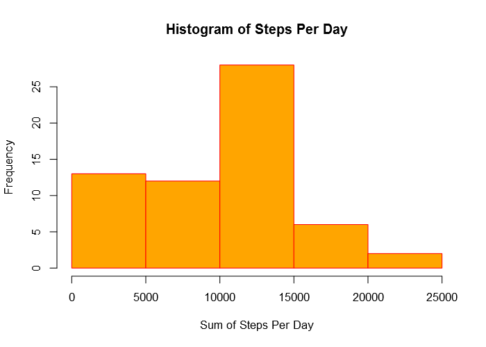
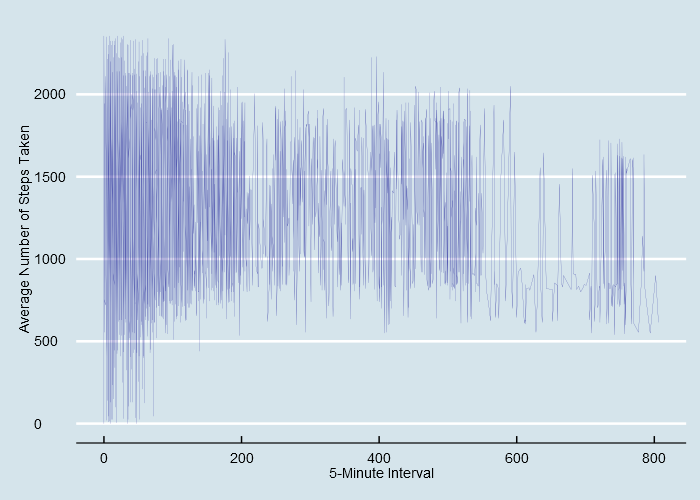
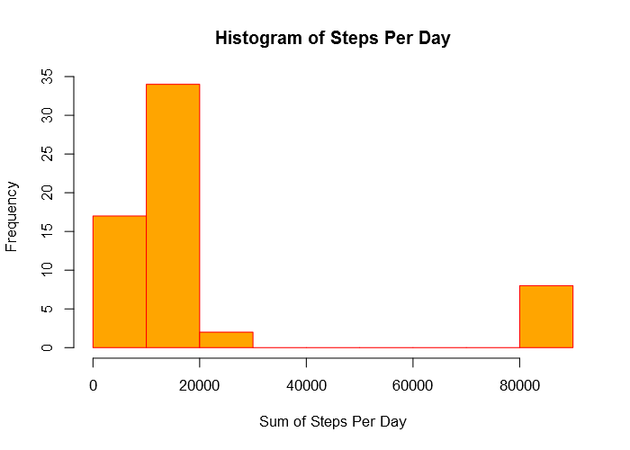
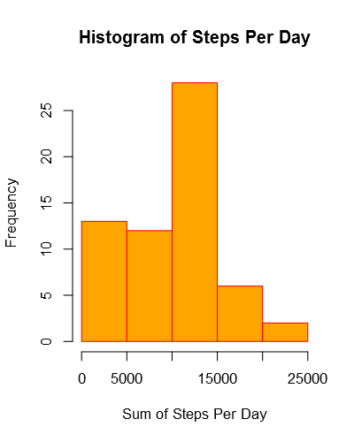
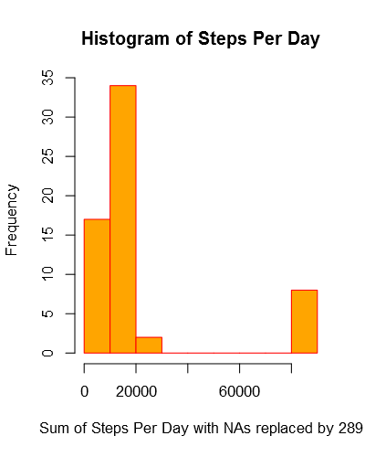
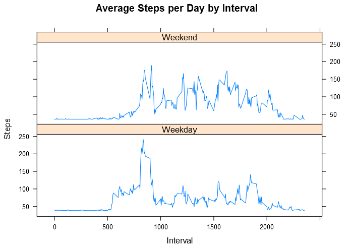

# Reproducible Research: Peer Assessment 1

The source files are posted on [GitHub](https://github.com/abdullahalbyati/RepData_PeerAssessment1)
<hr class="separator"; style = "border-bottom:10px double orange;">
## Loading and preprocessing the data
<hr class="separator"; style = "border-bottom:10px double orange;">


```r
download.file("https://d396qusza40orc.cloudfront.net/repdata%2Fdata%2Factivity.zip", "activity.zip" )
unzip("activity.zip")
activity_data <- read.csv("activity.csv")
```
### let's have a feel of the activity.csv data frame

```r
summary(activity_data)
#      steps                date          interval     
#  Min.   :  0.00   2012-10-01:  288   Min.   :   0.0  
#  1st Qu.:  0.00   2012-10-02:  288   1st Qu.: 588.8  
#  Median :  0.00   2012-10-03:  288   Median :1177.5  
#  Mean   : 37.38   2012-10-04:  288   Mean   :1177.5  
#  3rd Qu.: 12.00   2012-10-05:  288   3rd Qu.:1766.2  
#  Max.   :806.00   2012-10-06:  288   Max.   :2355.0  
#  NA's   :2304     (Other)   :15840
class(activity_data)
# [1] "data.frame"
class(activity_data$steps)
# [1] "integer"
class(activity_data$date)
# [1] "factor"
class(activity_data$interval)
# [1] "integer"
```
### The class of the date column of the data frame is "factor" while it should be "POSIXct" "POSIXt"
### We will use lubridate package to deal with the date

```r
require("lubridate")
activity_data$date <- ymd(activity_data$date)
class(activity_data$date)
# [1] "POSIXct" "POSIXt"
```

### What is mean total number of steps taken per day?

```r
require("dplyr")
steps_per_day <- tapply(activity_data$steps, activity_data$date, sum, na.rm = TRUE)
mean(steps_per_day)
# [1] 9354.23
median(steps_per_day)
# [1] 10395
```
### A Histogram of the total number of steps taking each day

```r
hist1 <- hist(steps_per_day, xlab = "Sum of Steps Per Day", 
     main = "Histogram of Steps Per Day", 
     col = "orange",
     border = "red"
     )
```

<!-- -->

### What is the average daily activity pattern?

```r
require("ggplot2")
require("ggthemes")
time_plot <- ggplot(activity_data, aes(steps, interval))+ geom_line(color="darkblue", size=0.05) +
xlab("5-Minute Interval") + ylab("Average Number of Steps Taken") + theme_classic() +
theme_economist() + scale_colour_economist()
time_plot
```

<!-- -->

###Which 5-minute interval, on average across all the days in the dataset, contains the maximum number of steps?


```r
max_steps <- tapply(activity_data$steps, activity_data$interval, mean, na.rm = TRUE)
max_steps[which.max(max_steps)]
#      835 
# 206.1698
```
<hr class="separator"; style = "border-bottom:10px double orange;">
## Imputing missing values
<hr class="separator"; style = "border-bottom:10px double orange;">


```r
sum(is.na(activity_data))
# [1] 2304
```
### Strategy for filling in all the missing values in the data set
### We will be replacing the missing values in the steps column with the minimum number of steps taking in the data set

```r
activity_data_no_NA <- activity_data
which.min(activity_data$steps)
# [1] 289
#Create a new dataset that is equal to the original dataset but with the missing data filled in.
activity_data_no_NA[is.na(activity_data_no_NA)] <- 289
```

### What is mean total number of steps taken per day with NAs replaced?

```r
require("dplyr")
steps_per_day_no_NA <- tapply(activity_data_no_NA$steps, activity_data_no_NA$date, sum)
mean(steps_per_day_no_NA)
# [1] 20269.9
median(steps_per_day_no_NA)
# [1] 11458
```
### A Histogram of the total number of steps taking each day with NAs replaced 

```r
hist2 <- hist(steps_per_day_no_NA, xlab = "Sum of Steps Per Day", 
     main = "Histogram of Steps Per Day", 
     col = "orange",
     border = "red"
     )
```

<!-- -->

###Do these values differ from the estimates from the first part of the assignment? What is the impact of imputing missing data on the estimates of the total daily number of steps?

Table: Comparison Table

Without NAs      With NAs replaced by 289 
---------------  -------------------------
Mean = 9354.23   Mean = 20269.9           
Median = 10395   Median = 11458           



<hr class="separator"; style = "border-bottom:10px double orange;">
## Are there differences in activity patterns between weekdays and weekends?
<hr class="separator"; style = "border-bottom:10px double orange;">

```r
require("latttice")
weekdays <- c("Monday", "Tuesday", "Wednesday", "Thursday", "Friday")
activity_data_no_NA$weekday <- as.factor(ifelse(is.element(weekdays(as.Date(activity_data_no_NA$date)),weekdays), "Weekday", "Weekend"))
activity_data_no_NA_agg <- aggregate(steps ~ interval + weekday, activity_data_no_NA, mean)
xyplot(activity_data_no_NA_agg$steps ~ activity_data_no_NA_agg$interval|activity_data_no_NA_agg$weekday, main = "Average Steps per Day by Interval",xlab="Interval", ylab="Steps",layout=c(1,2), type="l")
```

<!-- -->

